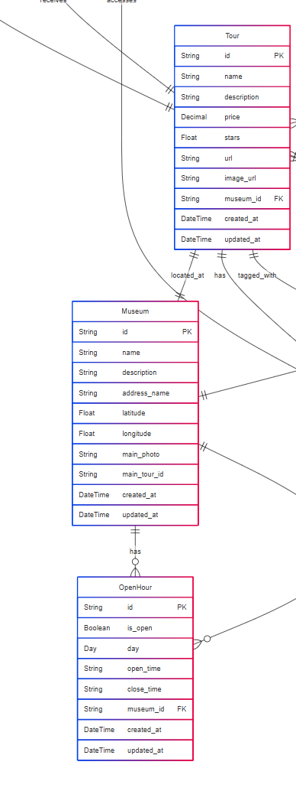

# Museums - Museos

Modelo diseñado para representar la información básica de un museo, incluyendo un modelo secundario para registrar los horarios de atención.

## Diagrama de datos

## Enpoints

### Crear museo

**POST:** /api/musums

## Schemas

**Museum**

| Campo        | Descripción                 | Tipo             | Opcional | Notas                                                     |
| ------------ | ---------------------------- | ---------------- | -------- | --------------------------------------------------------- |
| name         | Nombre del museo             | string           | No       |                                                           |
| description  | Descripción del museo       | string           | No       |                                                           |
| address_name | Dirección legible del museo | string           | No       |                                                           |
| main_photo   | Imagen principal del museo   | string (URL)     | No       | Debe ser una URL válida                                  |
| latitude     | Latitud geográfica          | number (float)   | No       | Ej. 19.4326                                               |
| longitude    | Longitud geográfica         | number (float)   | No       | Ej. -99.1332                                              |
| main_tour_id | ID del tour principal        | string (UUID)    | Sí      | Puede omitirse si el museo aún no tiene un tour asignado |
| hours        | Horarios de apertura         | array de objetos | Si       | Deben incluirse los 7 días de la semana                  |

**OpenHour**

| Campo     | Tipo    | Opcional | Notas                                                                         |
| --------- | ------- | -------- | ----------------------------------------------------------------------------- |
| day       | string  | No       | Día de la semana (ej. "MONDAY", "SUNDAY").                                   |
| isOpen    | boolean | No       | Indica si el museo está abierto ese día.                                    |
| openTime  | string  | Sí      | Hora de apertura en formato 24h (`HH:mm`). Requerido si `isOpen` es true. |
| closeTime | string  | Sí      | Hora de cierre en formato 24h (`HH:mm`). Requerido si `isOpen` es true.   |
